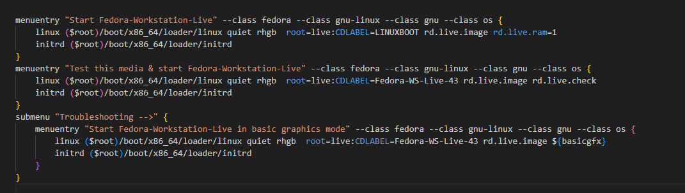

# A-way-to-install-fedora-without-usb
## Pre-installation
### Warning: you should understand what you are doing, like press E to edit the section in the GRUB menu, this is not a fully installation tutorial
Things you will need
* Your favorite fedora image
* A partition management tool. you can use the "create and format ..." on windows

Steps
1. Create a FAT32 partition for storing the image and name it, i will name it LINUXBOOT

  
2. Mount your image, turn on view hidden files, copy all of it to the LINUXBOOT  
3. On the LINUXBOOT partition, go to boot\grub2 and edit the grub.cfg file  
4. Find the section "menuentry "Start Fedora-Workstation-Live"" or the first menuentry section that you see  
5. At the CD label, change it to your partition name, amd at the end of that line, add rd.live.ram=1, this will make you boot the installer on your ram, it should look like this (you can press E to edit this when boot to GRUB menu btw, but i edited the GRUB configure file:D)    

6. Now restart and boot on that partition you have  
7. Once you booted to Fedora on the installer, go to terminal and type "sudo umount -l /run/initramfs/live", this will make your drive detectable  
8. Install as you do  
9. If your drive is undetected or the changes you make on your drive undetected by the "Install to Hard Drive" program, you should reopen it, every changes need "Install Fedora" to be reopen

### Tip:  
if you are using nvidia GPU, and your system is not bootable, on the grub menu, the first option, press E to edit, at the first line that start with "linux" add "nomodeset", it is like using a basic driver just to display. After setting up things, dnf upgrade, install nvidia driver, the "akmod" one.  
### Another tip:  
if your partition name is wrong, you can fix it by using the uuid of your fat32 partition instead of CDLABEL, use AI for this

